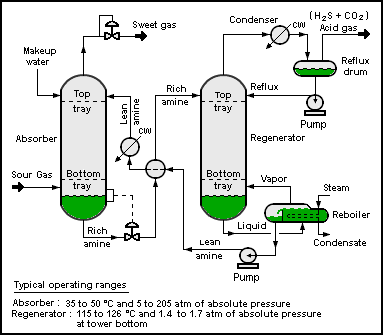
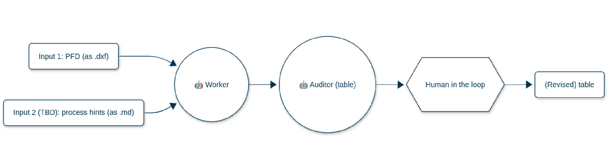
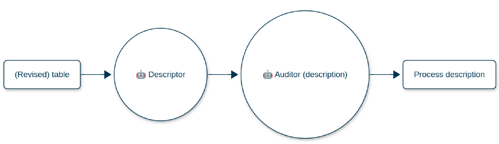
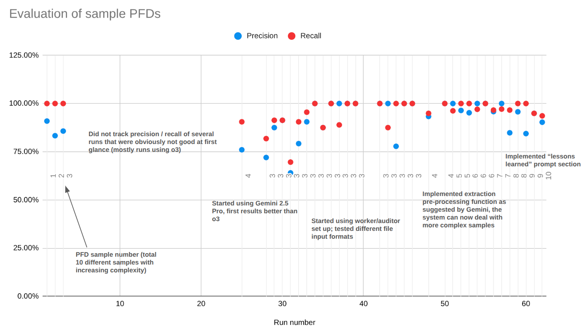

# PFD Agent

A Django-based web application for analyzing Process Flow Diagrams (PFDs) using AI/LLM technology. The system extracts equipment and connectivity information from DXF files and generates detailed process descriptions.



Source: https://en.wikipedia.org/wiki/Process_flow_diagram

## Overview

PFD Agent consists of two main applications:

### 1. PFD Bench

- **Purpose**: Generate process descriptions from PFD drawings
- **Access**: Available to all authenticated users
- **Workflow**:
  1. Upload DXF files (CAD drawings of process flow diagrams)
  2. AI extracts equipment and connectivity information
  3. Review and modify the extracted data
  4. Generate detailed process descriptions

**Important note:** We are in process of preparing sample dxf files of common process diagrams that can made available publicly.
We are bound by a non-disclosure agreement, therefore we cannot publicly share our current test set of diagrams.
If you have your own Autocad drawings, you only need to save them as a dxf file and use it with this code (see installation).

### 2. PFD Analyzer

- **Purpose**: Evaluate and analyze LLM performance on PFD analysis tasks
- **Access**: Staff users only
- **Features**:
  - Track multiple analysis runs per PDF
  - Compare different LLM models and prompts
  - Measure accuracy, precision, and recall
  - Lock runs to prevent accidental modifications

## AI Processing Pipeline

The system uses a two-stage AI pipeline:

### Stage 1: Equipment Extraction

1. **Worker Agent**: Analyzes DXF data and creates initial equipment table
2. **Auditor Agent**: Reviews and corrects the worker's output
3. **Output**: Structured table of equipment with connectivity



### Stage 2: Description Generation

1. **Generator Agent**: Creates process description from reviewed table
2. **Output**: Detailed narrative of the process flow



### Performance Evolution

The graph below shows the evaluation results of our PFD analysis system over 60+ test runs on increasingly complex 10 PFD samples:



**Evaluation methodology:**

The evaluation shown in the graph is human-based. Once a connectivity table is generated, a person checks if:

1. Each piece of equipment was found and correctly named
2. The number of inlets and their origin is correctly identified
3. The number of outlets and their destinations are correctly identified

**Key milestones:**

- **Runs 1-3**: Initial testing phase with suboptimal performance (precision/recall ~75-90%)
- **Run ~25**: Switched to Gemini 2.5 Pro, achieving immediate performance improvements
- **Run ~35**: Implemented worker/auditor architecture and expanded file format support
- **Run ~50**: Added extraction pre-processing capabilities, enabling handling of more complex PFD samples
- **Run ~55+**: Incorporated "lessons learned" prompt optimization

The system now consistently achieves high precision and recall (>90%) across diverse PFD samples, demonstrating the effectiveness of our iterative development approach combining different LLM models, architectural improvements, and prompt engineering techniques.

### Under Development

- Auditor step in during Description Generation.

- Observer parallel workflow that self improves the equipment extraction and description. Planned to be a combination
  of automatic prompt updates and fine-tuning (dataset / suggestion generation, testing, deployment).

## Tech Stack

- **Backend**: Django 5.2.1
- **Database**: PostgreSQL (SQLite for development)
- **Task Queue**: Celery with Redis
- **Frontend**: Tailwind CSS, HTMX for dynamic updates
- **AI/ML**: LangChain, LangGraph, OpenAI, Google Gemini
- **File Processing**: ezdxf (for DXF file parsing)
- **Deployment**: Docker, Uvicorn (ASGI server)

## Project Structure

```
PFD_agent/
├── pfd_analyzer/          # LLM evaluation and analysis app
│   ├── models.py         # PFDFile, PFDRun models
│   ├── views.py          # Dashboard, file/run management
│   └── templates/        # Analyzer UI templates
├── pfd_bench/            # Process description generation app
│   ├── models.py         # Project, Run, EquipmentReview models
│   ├── views.py          # Project management, run review
│   ├── core/             # AI processing logic
│   │   ├── PFD_utils.py          # DXF extraction utilities
│   │   ├── PFD_bench_setup.py    # LangGraph workflow setup
│   │   └── PFD_prompt_templates.py # AI prompts
│   └── templates/        # Bench UI templates
├── templates/            # Base templates
├── requirements.txt      # Python dependencies
├── docker-compose.yml    # Development setup
└── docker-compose.prod.yml # Production setup
```

## Installation

### Prerequisites

- Python 3.11+
- PostgreSQL
- Redis (for Celery)
- Node.js (for Tailwind CSS)

### Local Development Setup

1. **Clone the repository**

   ```bash
   git clone <repository-url>
   cd PFD_agent
   ```

2. **Create and activate virtual environment**

   ```bash
   python -m venv venv
   source venv/bin/activate  # On Windows: venv\Scripts\activate
   ```

3. **Install dependencies**

   ```bash
   pip install -r requirements.txt
   ```

4. **Set up environment variables**

   ```bash
   cp .env.example .env  # Create this file with the following content
   ```

   Required environment variables:

   ```
   # Database
   DB_PASSWORD=your_db_password

   # AI/LLM API Keys
   OPENAI_API_KEY=your_openai_key
   GOOGLE_API_KEY=your_google_key

   # LangSmith (optional)
   LANGCHAIN_API_KEY=your_langsmith_key
   LANGSMITH_ENDPOINT=https://api.smith.langchain.com
   LANGCHAIN_TRACING_V2=true
   LANGCHAIN_PROJECT=pfd-agent
   ```

5. **Run migrations**

   ```bash
   python manage.py migrate
   ```

6. **Create superuser**

   ```bash
   python manage.py createsuperuser
   ```

7. **Install and build Tailwind CSS**

   ```bash
   python manage.py tailwind install
   python manage.py tailwind build
   ```

8. **Run development servers**

   ```bash
   # Terminal 1: Django server
   python manage.py runserver

   # Terminal 2: Celery worker
   celery -A PFD_agent worker -l info

   # Terminal 3: Redis
   redis-server

   # Terminal 4: Tailwind (for auto-rebuild)
   python manage.py tailwind start
   ```

### Docker Development Setup

1. **Set up environment variables**

   ```bash
   cp .env.example .env  # Configure as above
   ```

2. **Build and run with Docker Compose**

   ```bash
   docker compose up --build
   ```

3. **Run migrations (first time only)**
   ```bash
   docker compose exec web python manage.py migrate
   docker compose exec web python manage.py createsuperuser
   ```

The application will be available at http://localhost:8000

## Usage

### PFD Bench Workflow

1. **Create a Project**

   - Navigate to PFD Bench
   - Click "New Project"
   - Enter project name and description

2. **Upload DXF Files**

   - Within a project, click "Upload a file"
   - Select a DXF file containing a process flow diagram
   - Files are deduplicated - same file can be used across projects

3. **Start a Run**

   - Click "Start a new run"
   - Select or upload a DXF file
   - AI will process the file and extract equipment data

4. **Review Equipment**

   - Review each equipment item extracted by AI
   - Make corrections if needed
   - Mark items as reviewed
   - Save as draft to continue later

5. **Generate Process Description**
   - Once all equipment is reviewed, click "Finalize Run"
   - AI generates a detailed process description
   - Export results as CSV or text file

### PFD Analyzer Workflow

1. **Upload PDF**

   - Navigate to PFD Analyzer (staff only)
   - Upload a PDF file for analysis

2. **Create Analysis Run**

   - Click "New Run"
   - Select PDF file and AI model
   - Paste LLM output
   - Enter evaluation metrics

3. **Lock/Unlock Runs**

   - Lock runs to prevent accidental changes
   - Comments remain editable even when locked

4. **Track Relationships**
   - Link related runs to track dependencies
   - Add descriptions of how runs relate

## Key Features

- **Multi-tenancy**: Users can only see their own projects
- **File Deduplication**: Same file can be used across multiple projects
- **Async Processing**: Long-running AI tasks handled by Celery
- **Review Workflow**: Human-in-the-loop review of AI outputs
- **Export Options**: CSV for equipment data, text for descriptions
- **Performance Tracking**: Metrics for accuracy, precision, recall
- **HTMX Integration**: Dynamic UI updates without page reloads

## Management Commands

- **Create test data**: `python manage.py create_test_data`
- **Clean orphaned files**: `python manage.py cleanup_orphaned_files`
- **Test markdown generation**: `python manage.py test_table_markdown_generation <run_id>`

## Environment Variables

See example.env

| Variable               | Description                  | Required        |
| ---------------------- | ---------------------------- | --------------- |
| `DB_PASSWORD`          | PostgreSQL password          | Yes             |
| `OPENAI_API_KEY`       | OpenAI API key               | Yes             |
| `GOOGLE_API_KEY`       | Google AI API key            | Yes             |
| `LANGCHAIN_API_KEY`    | LangSmith API key            | Optional        |
| `LANGCHAIN_TRACING_V2` | Enable LangSmith tracing     | Optional        |
| `LANGCHAIN_PROJECT`    | LangSmith project name       | Optional        |
| `CELERY_BROKER_URL`    | Redis URL for Celery         | Auto-configured |
| `DATABASE_URL`         | PostgreSQL connection string | Auto-configured |

## License

- **Code**: Licensed under **Apache-2.0**. See `LICENSE`.
- **Sample data** (files under `data/` or otherwise marked): **CC BY 4.0**. See `data_license/LICENSE`.

If you contribute, you agree that your contributions are licensed under the same terms.

## Support

For issues and questions:

- Check the logs in `logs/` directory
- Review Django admin panel
- contact info@lyfx.ai

## Author

- Andre Moreira
- a.moreira@lyfx.ai
